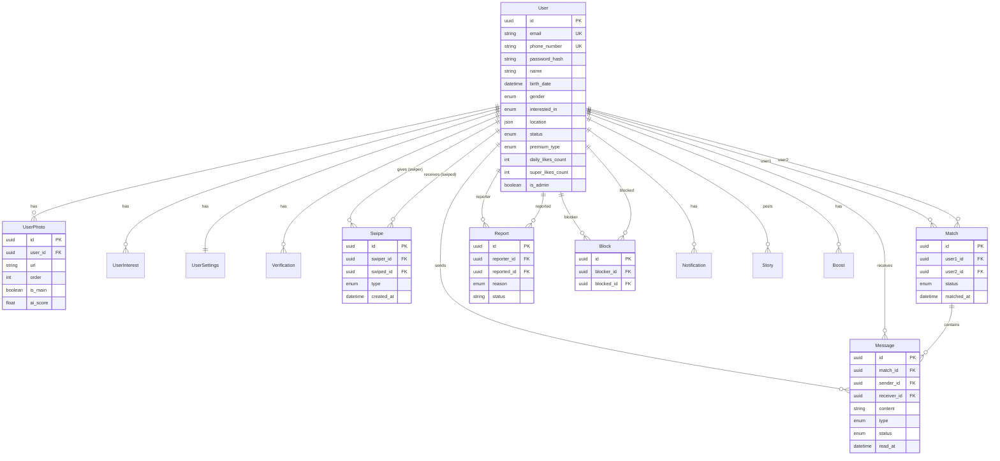

# Database ERD

The schema is defined in [`backend/prisma/schema.prisma`](../backend/prisma/schema.prisma).
Distance-based recommendation is computed in the application layer (Haversine);
for production scale, move it to PostGIS or a Redis geospatial index
(`user:locations`, already populated on location update).

## Key constraints & indexes

| Table | Unique | Indexes |
|-------|--------|---------|
| users | email, phone_number | (gender, interested_in), status, premium_type, last_active_at, created_at |
| swipes | (swiper_id, swiped_id) | swiper_id, swiped_id, created_at |
| matches | (user1_id, user2_id) | user1_id, user2_id, status |
| messages | — | match_id, sender_id, receiver_id, created_at |
| blocks | (blocker_id, blocked_id) | blocker_id |
| user_interests | (user_id, name) | user_id |

`matches` always stores the canonical ordered pair `(min(id), max(id))` so the
unique constraint prevents duplicate matches regardless of who liked first.
